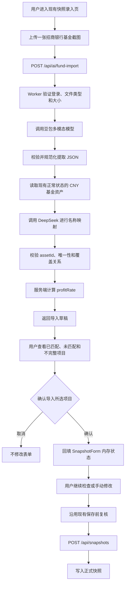

# 招商银行基金截图 AI 快捷录入设计

日期：2026-07-25

## 背景

RiceFinanceU 是个人资产快照账本。当前快照录入页会读取现有资产和上一份快照，把全部可录入资产预填到表格中；用户修改本次金额、收益或收益率，复核后保存新的完整快照。

目前的主要痛点是基金持仓数据需要逐项手工录入。第一期增加一种前置输入方式：用户上传招商银行基金页面截图，系统使用豆包多模态模型提取基金持仓数据，再使用 DeepSeek 将截图中的基金名称映射到现有资产，最后由用户确认并回填当前录入表单。

这项能力不是新的记账流程，也不改变资产快照领域模型。它只是现有录入页的快捷输入适配器。

## 产品目标

1. 在现有网页端快照录入页支持上传一张招商银行基金页面截图。
2. 从截图中提取每只基金的名称、当前持仓金额和持有收益。
3. 将识别到的基金名称与系统现有、正常录入状态的基金资产进行映射。
4. 把已匹配项目的金额、收益和计算所得收益率作为草稿展示给用户。
5. 用户确认后才回填现有表单；用户继续使用现有保存前复核和快照保存流程。
6. AI 不创建资产、不修改资产主数据、不直接保存快照。

## 非目标

- 不支持招商银行以外的截图来源。
- 不支持 PDF、相册批量导入或多张截图合并。
- 不在第一期为未匹配基金创建资产、跳转资产管理或进行手动重映射。
- 不识别股票、黄金、存款、现金、公积金或其他资产。
- 不让 AI 直接计算或决定收益率。
- 不把图片、模型原始响应或导入草稿保存到 KV、R2 或其他持久化存储。
- 不在第一期为微信小程序增加上传界面；后端协议保持可复用。
- 不引入 Cloudflare Queues、Workflows、Durable Objects 或异步任务轮询。

## 已有实现基础

现有网页端链路为：

```text
EntryPage
  -> SnapshotForm
  -> GET /api/assets + GET /api/snapshots/latest
  -> 用户编辑表格
  -> POST /api/snapshots
  -> Worker 校验并写入 KV
```

`SnapshotForm` 已经具备：

- 读取正常录入状态的资产并预填上一份快照。
- 对投资类资产编辑 `amount`、`profit` 和 `profitRate`。
- 当金额和收益已知时，使用 `profit / (amount - profit)` 计算收益率。
- 金额、收益和收益率校验。
- 未保存状态、保存前复核和大额变化提示。
- 通过现有 `POST /api/snapshots` 保存快照。

AI 导入应复用这些能力，不建立第二套录入、校验或保存逻辑。

## 方案比较

### 方案 A：Worker 同步编排两个模型（采用）

浏览器把截图上传给现有 Worker。Worker 顺序调用豆包和 DeepSeek，校验、合并结果后一次性返回导入草稿。

优点：

- 与当前单 Worker、单用户、低频使用的架构一致。
- 不需要新增持久化资源或后台任务。
- 浏览器只把图片交给本系统 Worker；模型 API 密钥始终只存在于服务端。
- 一次请求即可完成识别和匹配，前端状态简单。

缺点：

- 用户需要等待两次模型调用完成。
- 任一模型临时失败时，本次请求整体失败，需要重试。

第一期调用量低、单张截图数据量小，等待网络响应不消耗 Worker CPU 时间，因此该方案最符合当前规模。

### 方案 B：拆成“识别”和“匹配”两个前端可见阶段

提供两个 API，前端先调用豆包识别，再把识别结果提交给第二个 API 进行 DeepSeek 匹配。

优点是阶段状态更明确，也可以只重试失败阶段。缺点是前端需要持有和传递中间协议，接口与页面状态明显变复杂，而且客户端可以篡改中间数据。第一期不采用。

### 方案 C：R2 + Queues/Workflows 异步处理

先把截图写入 R2，再由队列或工作流执行两个模型调用，前端轮询任务状态。

该方案适合多图批处理、长时间任务和高并发，但会增加图片生命周期、任务幂等、清理策略和轮询界面。当前个人低频、单图流程没有必要采用。

## 总体流程



## Cloudflare 架构

### Worker

继续使用现有 `modules/worker-api` Worker，新增一个受现有 Bearer Session 保护的路由：

```text
POST /api/ai/fund-import
```

Worker 负责：

1. 验证登录状态。
2. 验证上传文件。
3. 调用豆包视觉模型。
4. 校验豆包 JSON。
5. 从 KV 中读取现有资产候选列表。
6. 调用 DeepSeek 进行名称映射。
7. 校验 DeepSeek JSON。
8. 计算收益率并生成前端草稿。

浏览器不直接调用任何模型服务，因此模型密钥不会暴露到前端。

### KV

继续只保存正式账本和 Session。AI 导入流程只读取资产数据，不在 KV 中写入图片、中间结果或草稿。

### R2、Queues 和 Workflows

第一期不使用。火山方舟视觉模型支持以 Base64 形式接收图片，因此不需要先把截图上传到 OSS、TOS、R2 或其他能生成公网 URL 的对象存储。

具体传输链路为：

```text
浏览器
  -> multipart/form-data 原始图片
  -> Cloudflare Worker
  -> 在内存中转换为 data:<mime>;base64,<content>
  -> 豆包 Chat Completions 的 image_url.url
```

浏览器到 Worker 仍使用原始文件，而不先转 Base64。这样可以避免浏览器到 Worker 这一段约三分之一的 Base64 体积膨胀，也不会把模型调用细节放进前端。Worker 使用分块安全的方式完成编码，图片和 Base64 字符串只存在于本次请求内存中，请求结束后不保留。

### AI Gateway

第一期以 Worker 直接 `fetch` 两家模型 API 为基线，减少额外配置。

Cloudflare AI Gateway 已提供 DeepSeek 的 provider endpoint，后续可以在不改变业务协议的前提下把 DeepSeek 请求切换到 Gateway，以获得耗时、状态、Token 和成本等元数据。若启用 Gateway：

- 对金融图片和持仓数据禁用缓存。
- 设置 `cf-aig-collect-log-payload: false`，只保留元数据，不保存请求和响应正文。
- 豆包若通过 Custom Provider 接入，需要单独评估当时的稳定性；第一期不依赖该 Beta 能力。

相关官方能力：

- [Cloudflare Workers Secrets](https://developers.cloudflare.com/workers/configuration/secrets/)
- [Cloudflare Workers 外部服务调用](https://developers.cloudflare.com/workers/configuration/integrations/external-services/)
- [Cloudflare AI Gateway 的 DeepSeek endpoint](https://developers.cloudflare.com/ai-gateway/usage/providers/deepseek/)
- [AI Gateway 控制日志正文采集](https://developers.cloudflare.com/ai-gateway/observability/logging/)

## 配置与密钥

生产环境新增两个 Cloudflare Worker Secrets：

```text
DOUBAO_API_KEY
DEEPSEEK_API_KEY
```

新增非敏感环境变量：

```text
DOUBAO_API_BASE
DOUBAO_MODEL
DEEPSEEK_API_BASE
DEEPSEEK_MODEL
```

模型名称不写死在业务代码中，以便供应商升级模型时只调整配置。DeepSeek 当前官方 API 使用 OpenAI 兼容格式；实施时选择仍受支持的非思考模型，因为名称映射不需要复杂推理。模型返回使用 JSON Output，官方要求同时设置 `response_format: {"type":"json_object"}`，并在提示词中明确 JSON 和目标示例：

- [DeepSeek API 快速开始](https://api-docs.deepseek.com/)
- [DeepSeek JSON Output](https://api-docs.deepseek.com/guides/json_mode/)

豆包使用火山方舟 Chat Completions 多模态接口，图片作为视觉内容传入：

- [火山方舟 ChatCompletions API](https://api.volcengine.com/api-docs/view?action=ChatCompletions&serviceCode=ark&version=2024-01-01)
- [豆包视觉模型接入介绍（含 Base64 图片输入）](https://console.volcengine.com/ark/region:cn-beijing/docs/82379/1494384?lang=zh)

本地开发继续使用未提交到 Git 的 `.dev.vars`。

## 上传接口

### 请求

```http
POST /api/ai/fund-import
Authorization: Bearer <session-token>
Content-Type: multipart/form-data
```

表单字段：

```text
image: File
```

第一期约束：

- 每次只允许一张图片。
- 支持 JPEG、PNG 和 WebP。
- 文件最大 10 MiB。
- 不接受 SVG、PDF、HEIC 或仅由扩展名伪装的文件。
- Worker 同时检查 `File.type` 和文件头签名。

10 MiB 是本产品主动设置的上限，远低于 Cloudflare 常见账户的请求体限制，也能避免单个请求在 Worker 中占用过多内存。Cloudflare Workers 当前内存上限为 128 MB，上传体限制取决于 Cloudflare 账户套餐：

- [Cloudflare Workers Limits](https://developers.cloudflare.com/workers/platform/limits/)

Worker 校验图片后读取二进制内容，按照实际 MIME 类型生成：

```text
data:image/png;base64,<base64-content>
```

然后把该值放入豆包多模态消息的 `image_url.url`。不创建临时对象、不生成外部下载地址，也不需要图片清理任务。

### 成功响应

```json
{
  "requestId": "uuid",
  "summary": {
    "recognized": 3,
    "matched": 2,
    "unmatched": 1,
    "incomplete": 0
  },
  "items": [
    {
      "extractionId": "item-1",
      "sourceName": "招商中证白酒指数证券投资基金",
      "amount": 12888.66,
      "profit": -321.45,
      "profitRate": -0.024336,
      "status": "matched",
      "assetId": "existing-asset-id",
      "assetName": "招商中证白酒指数"
    },
    {
      "extractionId": "item-2",
      "sourceName": "某基金名称",
      "amount": 5000,
      "profit": 120,
      "profitRate": 0.02459,
      "status": "unmatched",
      "reason": "未匹配到现有基金资产"
    }
  ]
}
```

`status` 取值：

- `matched`：可供用户勾选并导入。
- `unmatched`：没有可信映射，第一期只能查看。
- `incomplete`：名称、金额或收益缺失，不能导入。

模型供应商名称、模型原始响应和提示词不返回给浏览器。

## 豆包提取协议

豆包只负责从图片中提取可见事实，不负责匹配资产，也不负责计算收益率。

期望的规范化输出：

```json
{
  "items": [
    {
      "sourceName": "图片中显示的基金名称",
      "amount": 12345.67,
      "profit": -234.56,
      "issues": []
    }
  ]
}
```

规则：

1. 只提取基金明细行，不把页面总计识别成基金。
2. `sourceName` 保留图片中的基金名称，用于后续映射。
3. `amount` 表示当前持仓市值或持仓金额。
4. `profit` 表示持有收益，必须保留正负号。
5. 千分位、人民币符号和空格在服务端规范化。
6. 看不清或图片中没有显示的数字返回 `null`，禁止推测。
7. 不从图片中的收益率反推出金额或收益。
8. 不接受 `NaN`、`Infinity`、科学计数法或嵌入单位的字符串作为最终数值。

即使模型承诺返回 JSON，Worker 仍必须执行运行时 Schema 校验。格式错误、字段越界或非有限数字不能进入下一步。

Worker 在校验后自行分配 `extractionId`，不信任模型生成的 ID。

## DeepSeek 映射协议

DeepSeek 只接收：

- 每个完整提取项的 `extractionId` 和 `sourceName`。
- 当前账本中 `type === "fund"`、`entryStatus === "normal"`、`currency === "CNY"` 的候选资产 `id` 和 `name`。

DeepSeek 不接收原始截图，也不允许修改金额和收益。

期望输出：

```json
{
  "matches": [
    {
      "extractionId": "item-1",
      "assetId": "existing-asset-id",
      "status": "matched",
      "reason": "核心基金名称一致，仅省略了法律后缀"
    },
    {
      "extractionId": "item-2",
      "assetId": null,
      "status": "unmatched",
      "reason": "没有足够接近的候选资产"
    }
  ]
}
```

映射规则：

1. 只能从候选 `assetId` 中选择，不能编造 ID。
2. 每个提取项最多映射一个资产。
3. 一个资产在同一张截图中最多被映射一次。
4. 名称相近但存在关键指数、系列、份额类别或基金公司冲突时应返回未匹配。
5. 无可信候选时返回 `unmatched`，不选择“最接近但不确定”的资产。
6. DeepSeek 缺失提取项、返回重复映射或返回候选集外 ID 时，Worker 将对应项目降级为未匹配。

金额和收益通过 `extractionId` 与豆包结果关联；DeepSeek 输出中的任何额外金额字段都会被忽略。这一边界防止第二个模型修改第一个模型提取的金融数值。

## 收益率计算

收益率由 Worker 使用确定性公式计算：

```text
cost = amount - profit
profitRate = profit / cost
```

规则：

- `amount` 必须是大于等于 0 的有限数。
- `profit` 必须是有限数，可以为负。
- 只有 `cost > 0` 时才生成 `profitRate`。
- `profitRate` 使用与现有 `SnapshotValue` 相同的小数形式，例如 `0.1` 表示 `10%`。
- API 草稿保留最多 6 位小数；前端回填时沿用现有百分比格式化和最终保存校验。
- 当成本小于等于 0 时，项目标记为 `incomplete`，提示“无法由金额和收益计算有效收益率”，不自动导入。

## 前端交互

### 入口

在现有 `SnapshotForm` 顶部操作区增加“从截图导入”按钮，不新建独立页面。

点击后选择一张图片并立即开始上传。处理期间：

- 禁止重复提交。
- 显示统一状态“正在识别并匹配基金持仓…”。
- 用户仍可取消文件选择；请求发出后不承诺中止供应商调用。

### 草稿确认

接口成功后打开轻量确认区域或弹窗，逐行展示：

- 截图基金名称。
- 匹配到的现有资产名称。
- 本次持仓金额。
- 持有收益。
- 系统计算的收益率。
- 匹配状态或不能导入的原因。

已匹配项目默认勾选，用户可以取消某一项。未匹配和不完整项目不可勾选。第一期不在确认区域中编辑数字或手动选择资产；需要修改时，先导入，再在现有表格中修改。

### 确认回填

用户点击“确认导入”后，以一次 React 状态更新完成回填：

- 使用 `assetId` 找到现有表格行。
- 覆盖 `amount`、`profit` 和 `profitRate`。
- 把该行设为 `included: true`。
- 把该行状态设为 `ai-imported`，展示“AI 导入”状态。
- 把表单设为未保存状态。

未匹配、不完整或被用户取消勾选的项目不修改任何表格行。

用户取消整个确认步骤时，不修改任何表格行。这样避免出现半次导入。

### 正式保存

导入只是表单回填。用户仍可以：

- 修改任意已回填字段。
- 取消纳入某一资产。
- 调整快照时间和备注。
- 取消本次录入或离开页面。

最终仍调用现有 `handleSubmit` 和 `POST /api/snapshots`。不新增“AI 专用保存接口”。

## 模块边界

建议新增或调整以下单元：

```text
modules/worker-api/
  index.js                         路由接入、认证和响应
  ai/
    fundImport.js                  同步编排与草稿组装
    fundImportSchemas.js           运行时校验和规范化纯函数
    doubaoClient.js                豆包 API 适配器
    deepseekClient.js              DeepSeek API 适配器
    prompts.js                     版本化提示词

modules/web-app/src/
  api/client.ts                    上传接口与响应类型
  components/SnapshotForm.tsx      导入入口和表单回填
  components/FundImportReview.tsx  草稿确认
```

产品规则归属：

- “哪些资产可作为候选”和“收益率如何计算”是领域规则，应写成小型纯函数并测试。
- 模型请求格式属于 Worker provider adapter。
- 图片选择、进度、确认和回填属于网页端 adapter。
- 正式快照校验和保存仍属于现有快照链路。

第一期不强制把这些规则提取到尚未落地的 `finance-core`，但不能在 Worker 和前端各写一套不同的收益率公式。Worker 返回规范化 `profitRate`，前端只负责显示与回填。

## 错误处理

| 场景 | HTTP/行为 | 用户提示 |
|---|---|---|
| 未登录或 Session 失效 | `401` | 沿用现有重新登录行为 |
| 缺少图片 | `400` | 请选择招商银行基金截图 |
| 类型或文件头不支持 | `415` | 仅支持 JPEG、PNG 或 WebP |
| 超过 10 MiB | `413` | 图片过大，请压缩后重试 |
| 豆包调用失败或超时 | `502` | 图片识别失败，请稍后重试 |
| 豆包输出无法解析 | `422` | 未能从截图中识别出有效基金数据 |
| 没有完整基金项目 | `422` | 截图中没有可导入的基金持仓 |
| DeepSeek 调用失败或超时 | `502` | 基金匹配失败，请稍后重试 |
| 部分项目无法映射 | `200` | 返回草稿并逐项标记未匹配 |
| 前端确认时目标资产已不在表格 | 本地跳过 | 部分资产状态已变化，请刷新后重试 |

供应商错误不把原始响应、密钥、请求头或内部堆栈返回给浏览器。

第一期不自动重试整个链路，以避免重复计费。可以对明确的网络连接失败或 `429/5xx` 在 provider adapter 内进行最多一次短退避重试；重试策略必须有测试，并记录不含正文的结构化元数据。

## 隐私与安全

招商银行截图可能包含账户标识和个人资产数据，因此：

1. 接口必须使用现有 Session 认证。
2. API Key 只存放在 Cloudflare Secrets。
3. 图片不写入 KV、R2、Cache API 或 Worker 日志。
4. 图片原始字节和 Base64/Data URL 只在当前 Worker 请求内存中存在，不传给 DeepSeek。
5. 不记录提示词、图片 Base64、基金名称、金额、收益或模型原始响应。
6. 日志只允许记录 `requestId`、阶段、耗时、项目数量、供应商状态码和错误类别。
7. AI Gateway 若启用，必须禁用缓存并关闭 payload 日志。
8. 前端不把导入草稿写入 `localStorage` 或其他持久化浏览器存储。
9. 用于自动化测试的图片必须是合成或脱敏样本，不提交真实个人金融截图。

页面应在上传入口附近说明：截图会发送给豆包用于识别，提取后的基金名称会发送给 DeepSeek 用于匹配。

## 可观测性

每次请求生成 `requestId`。结构化日志记录：

```text
requestId
stage: upload | doubao | normalize | deepseek | merge
durationMs
recognizedCount
matchedCount
unmatchedCount
providerStatus
errorCode
```

日志不得包含任何金融数据正文。

现有 Wrangler 已启用 Workers Observability，因此第一期无需新增日志产品。后续若接入 AI Gateway，可获得模型调用元数据，但仍不保存 payload。

## 测试策略

### Worker 纯函数测试

- 豆包合法 JSON 的规范化。
- 千分位、人民币符号和正负收益处理。
- `null`、非法数字和缺失字段处理。
- 收益率公式及成本小于等于 0 的边界。
- DeepSeek 候选集外 `assetId` 被拒绝。
- 重复 `assetId` 映射被降级。
- 缺失映射项目被降级。
- 只有正常状态、CNY 基金进入候选列表。

### Worker 路由测试

- 认证失败。
- 文件缺失、文件类型错误、伪造 MIME 和超过大小限制。
- 豆包成功、DeepSeek 成功的完整链路。
- 两家供应商分别失败、超时和返回坏 JSON。
- 部分匹配成功仍返回 `200` 草稿。
- AI 请求不会写入 KV。
- API 响应和日志不泄露模型密钥或原始图片。

外部调用通过注入的 `fetch` 或 provider adapter mock 测试，单元测试不访问真实模型 API。

### 前端测试

- 选择合法图片后进入处理状态。
- 非法图片在请求前被拒绝。
- 正确展示 matched、unmatched 和 incomplete。
- 未匹配项不可勾选。
- 取消确认不改变原表格。
- 确认时只更新被勾选的已匹配行。
- 回填后金额、收益和收益率正确，状态为“AI 导入”且表单变脏。
- 用户仍可手动覆盖 AI 值。
- 现有保存前复核和快照提交保持不变。

### 人工冒烟验证

使用一张脱敏的招商银行基金页面截图，在本地或预发布环境验证：

1. 豆包输出的基金数量和数值与图片一致。
2. DeepSeek 能处理简称、法律后缀和轻微名称差异。
3. 不确定的名称不会被强制匹配。
4. 用户取消导入时表格完全不变。
5. 用户确认导入后仍需点击现有保存按钮才产生新快照。

## 验收标准

1. 网页端快照录入页可以上传一张合法的招商银行基金截图。
2. API Key 不出现在前端代码、网络响应或日志中。
3. 豆包只提取基金名称、持仓金额和持有收益。
4. DeepSeek 只能从现有正常状态的 CNY 基金资产中返回 `assetId`。
5. DeepSeek 不能修改金额和收益。
6. 收益率由系统按 `profit / (amount - profit)` 计算。
7. 未匹配和不完整项目不会回填。
8. 用户取消确认时现有表单数据保持不变。
9. 用户确认后只修改所选已匹配行，并明确显示为“AI 导入”。
10. AI 导入不会创建资产、修改资产主数据或直接保存快照。
11. 最终保存继续使用现有快照校验、复核和 `POST /api/snapshots`。
12. 图片、模型原始响应和导入草稿不会被持久化。
13. 豆包图片输入使用请求内 Base64/Data URL，不依赖 OSS、TOS、R2 或临时公网 URL。
14. 新增逻辑有 Worker 和前端自动化测试覆盖，现有测试继续通过。

## 后续演进方向

只有实际使用证明需要时，再考虑：

- 多张截图合并和去重。
- 小程序上传入口。
- 未匹配项的手动资产选择。
- 支持更多银行或券商模板。
- 用 AI Gateway 统一两家供应商的元数据观测。
- 大批量任务改为 R2 + Workflows 异步处理。

这些方向不属于第一期实现范围。
